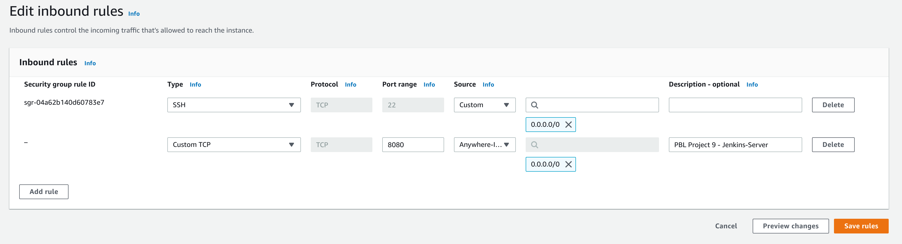
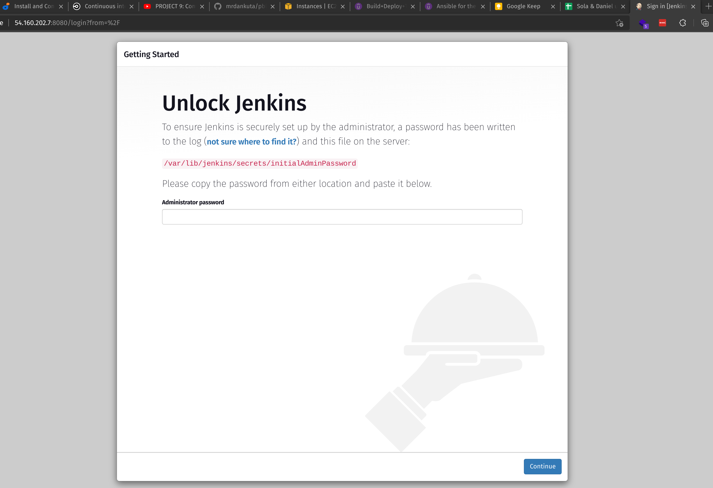
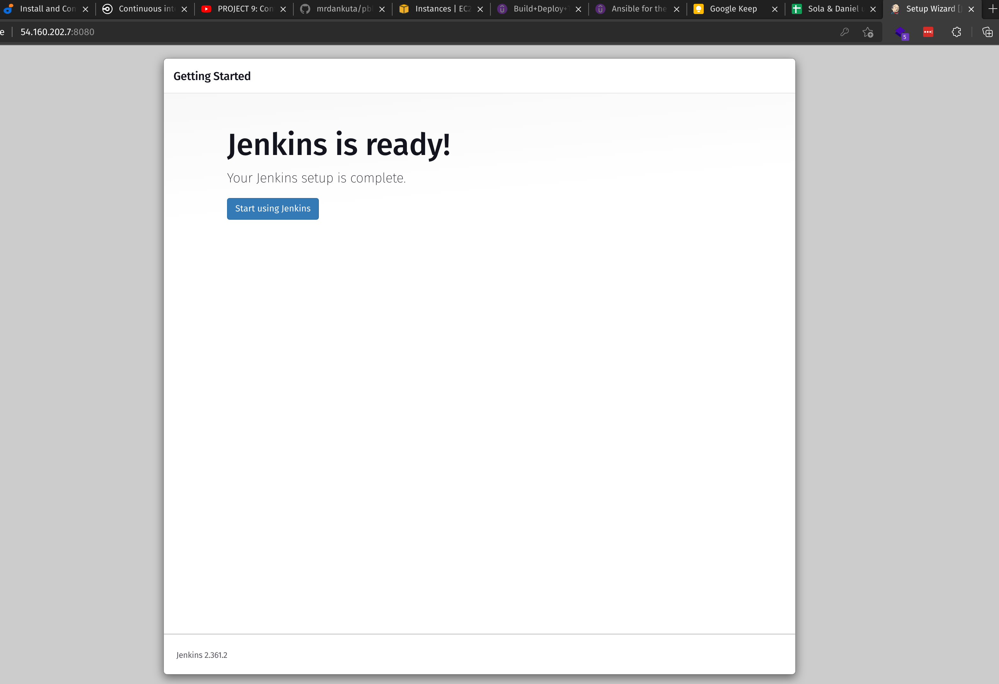
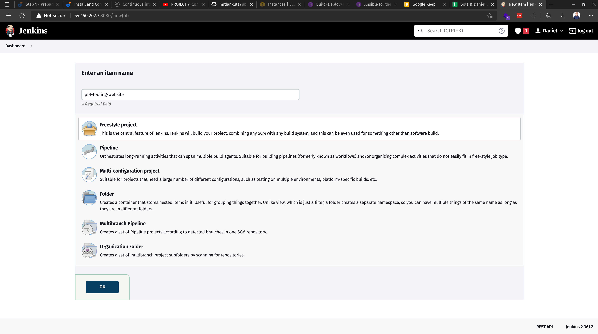
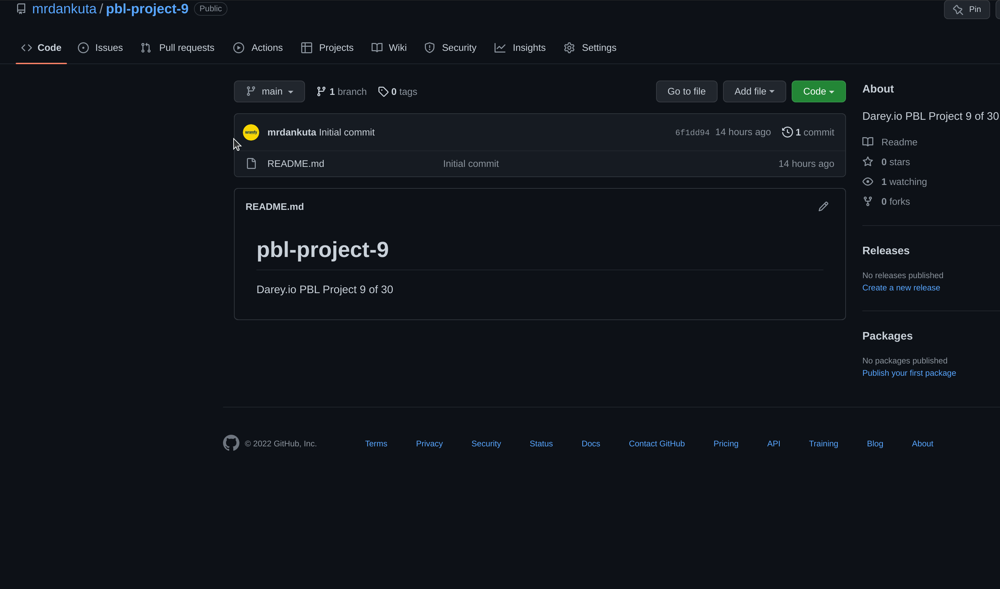
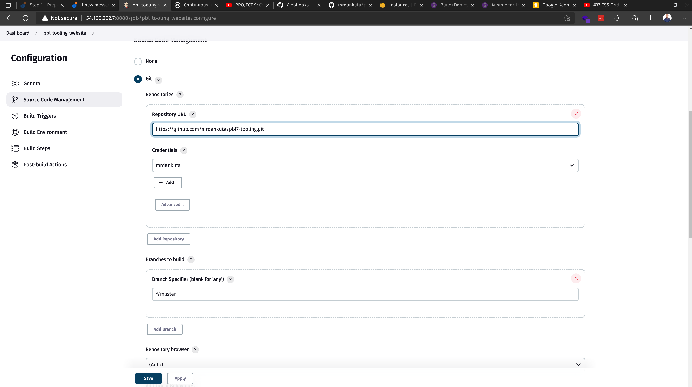
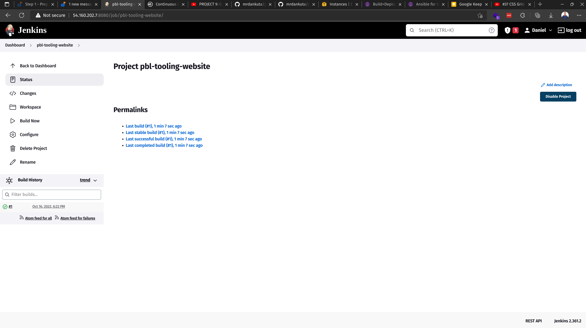
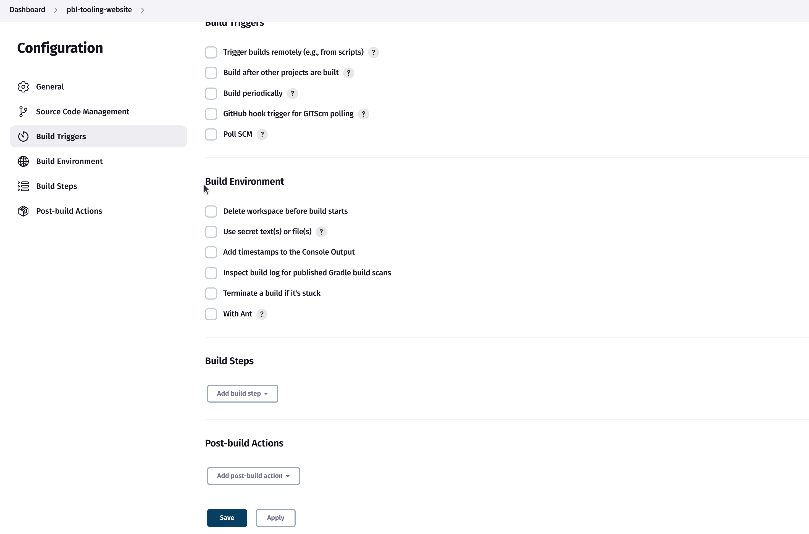

# Project 9 - Continous Integration Pipeline For Tooling Website

*Continuation of [Project 8](https://github.com/mrdankuta/pbl-project-8)*

---

## Install Jenkins Server

- In EC2 spin up an Ubuntu server named `jenkins`
- Install JDK:
    ```
    sudo apt update
    sudo apt install default-jdk-headless
    ```
- Install Jenkins:
    ```
    wget -q -O - https://pkg.jenkins.io/debian-stable/jenkins.io.key | sudo apt-key add -
    sudo sh -c 'echo deb https://pkg.jenkins.io/debian-stable binary/ > /etc/apt/sources.list.d/jenkins.list'
    sudo apt update
    sudo apt-get install jenkins
    ```
- Verify Jenkins is active:
    ```
    sudo systemctl status jenkins
    ```
- In EC2 open TCP port `8080`
    


## Configure Jenkins Server


- Visit `http://<jenkins-server-public-ip-address>:8080` in browser to begin Jenkins configuration
    
- Get Initial Admin Password from `/var/lib/jenkins/secrets/initialAdminPassword`:
    ```
    sudo cat /var/lib/jenkins/secrets/initialAdminPassword
    ```
- Login. 
- Install suggested plugins. 
- Create first admin user.
- Jenkins is ready!
    
- Create new job/project. Give it a name, select `Freestyle project` and click `ok`
    
- Connect jenkins project to Github repository via Webhook by adding `http://<jenkins-server-public-ip-address>:8080/github-webhook` as the payload URL in Settings -> Webhook in Github repository
    
- In Jenkins project, under configuration -> Source Code Management, select `Git`, enter Github repository URL and credentials, save.
    
- Test configuration by clicking `Build Now`
    
- Configure automatic triggering from Github Webhook
    
- Test automation by editing file(s) in repository and push the changes
